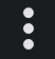
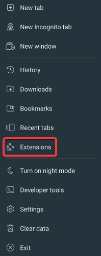
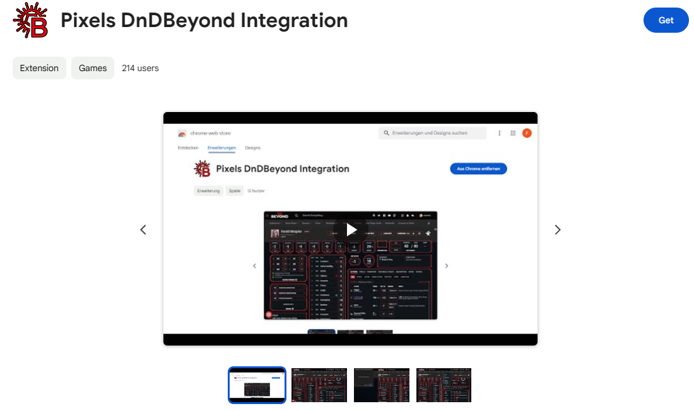

# How to use the extension on mobile devices
The chrome extension (and the tampermonkey script) can be used on mobile devices.
There are some limitations though:
- Since the extension is a chrome extension, it needs to be installed in a browser that supports chrome extensions
- Apple forces all browsers to use it's own engine (WebKit), which makes it impossible to use the extension on iOS at the moment

## Installing the browser
We first need to install a browser that supports chrome extensions. In this guide we'll be using the [Kiwi Browser](https://play.google.com/store/apps/details?id=com.kiwibrowser.browser). Of course you can use any other browser that supports chrome extensions and has the Bluetooth Web API enabled. But for the sake of simplicity, we'll be using the Kiwi Browser.

First open the play store and search for `Kiwi Browser` and install it:

Now that you installed the browser, open it for the first time. You may get the initial popups asking you for permissions and to setup the browser. Once you have gone through that, you should be on an (empty) page.

## Installing the extension
Now that you have installed the browser, click on the 3 dots to the right of the address bar and select `Extensions`:

Now click on `Extensions`:

Here you can manage your extensions. But we don't have any extensions installed yet. To do that tap on `+ (from store)`. A tab with the chrome web store should pop up. Search for `Pixels DnDBeyond`. You should find the following extension:

Install the extension. Now you are all prepared to use your pixel dice!

## Using the extension
Now that you have installed the extension, go to [dndbeyond.com](https://dndbeyond.com/). Since this is a new browser, you will need to login with your account. Once you are logged in, go to your characters and select the character you want to use.

Here you can see the pixels logo at the top center of the page. When you don't see it, that means that something went wrong in the previous steps.

To connect a die, open the burger menu on the top right and select `Connect to Pixels`. Now a popup from the browser should appear, showing you a list of pixels to connect to. Select the pixel die you want to connect to and tap on pair. If you don't see your pixel, make sure that it is awake (when it just sits there for a few minutes it will go into a sleep mode. In that case just move it around a bit and it will wake up). Also make sure that the die isn't connected to any other application (like the official pixels app or any other integration).

Since version `0.9.2` pixel mode is enabled by default when you open a character sheet. This means that you can tap on any of the dice roll buttons and the extension will check if you have at least 1 pixel connected that you can use to make the roll. If yes, the coresponding dice/die will light up yellow, to let you know that you can use them to do the roll. If you don't have the matching pixel connected, the roll will be made like normal with virtual dice.